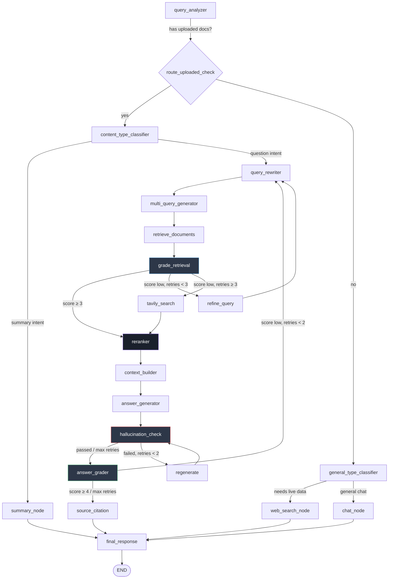

<div align="center">

# 🧠 PNX AI

### Self-Correcting Agentic RAG Chatbot

*A production-grade Retrieval-Augmented Generation system that grades its own retrieval, catches its own hallucinations, and rewrites its own answers — without a human in the loop.*

[](https://www.python.org/)
[](https://fastapi.tiangolo.com/)
[](https://langchain-ai.github.io/langgraph/)
[](https://www.pinecone.io/)
[](https://nodejs.org/)
[](LICENSE)

[Overview](#-overview) • [Architecture](#-architecture) • [Self-Correction](#-self-correction-mechanisms) • [Evaluation](#-evaluation-results) • [Tech Stack](#-tech-stack) • [Getting Started](#-getting-started)

</div>

---

## 📖 Overview

**PNX AI** is an agentic RAG chatbot built to solve a problem most naive RAG systems ignore: *what happens when retrieval pulls the wrong chunk, or the model hallucinates anyway?*

Instead of a fixed retrieve → generate pipeline, PNX AI is built as a **cyclic LangGraph workflow** where every stage is graded, and failures trigger automatic, bounded self-correction loops:

- 🔍 **Retrieval is graded** — if retrieved documents don't score well enough, the query is rewritten and retried (up to 3x) before falling back to live web search
- 🛡️ **Every answer is checked for hallucination** against its source context before it's shown to the user — failing answers are regenerated (up to 2x)
- ✅ **Every answer is graded for quality** — low-scoring answers trigger a full query rewrite and retry (up to 2x)
- 🎯 **Query-aware routing** — the graph dynamically routes between RAG, general chat, live web search, and document summarization based on what the user actually needs

This isn't a LangChain quickstart wrapped in a chat UI — it's a full evaluator-optimizer architecture, benchmarked with real metrics (below), and built as a two-person capstone project: an agentic AI backend paired with a full-stack web frontend.

---

## 🏗️ Architecture

PNX AI combines three established RAG patterns into one system:

| Pattern | What PNX AI Does |
|---|---|
| **Self-RAG** | Retrieval is graded before use; irrelevant context never reaches the generator |
| **Corrective RAG** | Failed retrieval triggers query refinement or falls back to live web search (Tavily) |
| **Agentic RAG** | The graph makes autonomous routing decisions — RAG vs. chat vs. web vs. summary — per query, with tool-bound reasoning |

### The Graph



### Why this matters

Every arrow that loops back is a **self-correction cycle** with a hard retry cap — the system attempts to fix itself, but never spins forever. This is the difference between "a RAG demo" and a system designed to degrade gracefully under imperfect retrieval or imperfect generation.

---

## 🔁 Self-Correction Mechanisms

| Stage | Trigger | Recovery Action | Max Retries |
|---|---|---|---|
| **Retrieval Grading** | Retrieved docs score < 3/5 relevance | Rewrite query and re-retrieve | 3 |
| **Retrieval Fallback** | Retrieval still failing after 3 retries | Fall back to live Tavily web search | — |
| **Hallucination Check** | Generated answer isn't grounded in context | Regenerate the answer from the same context | 2 |
| **Answer Grading** | Answer scores < 4/5 quality | Full query rewrite and re-run from retrieval | 2 |

This design means a single bad retrieval or a single hallucinated draft is **never** shown to the user — it's caught, corrected, and re-verified before the response is finalized in `source_citation` → `final_response`.

---

## 📊 Evaluation Results

PNX AI was evaluated end-to-end using **DeepEval**, with a local Ollama-hosted Mistral 7B as the LLM judge, across 15 domain-specific Q&A pairs built from an ingested reference document.

| Metric | Score | Pass Rate | What It Measures |
|---|---|---|---|
| **Contextual Precision** | 🟢 1.00 | 100% (15/15) | Are retrieved chunks actually relevant? |
| **Contextual Recall** | 🟢 1.00 | 100% (15/15) | Did retrieval find everything needed? |
| **Hallucination** | 🟢 0.00 *(lower = better)* | 100% (15/15) | Did the answer fabricate anything? |
| **Answer Relevancy** | 🟢 0.95 | 100% (15/15) | Does the answer address the question? |
| **Faithfulness** | 🟡 0.89 | 80% (12/15) | Is the answer grounded in retrieved context? |
| **Contextual Relevancy** | 🟡 0.82 | 80% (12/15) | Is the retrieved context relevant overall? |

> **On the two sub-100% metrics:** manual inspection of every sub-threshold case showed the pipeline's actual output was *identical* to the correct answer. The lower scores trace to known limitations of using a lightweight local judge model (Mistral 7B) rather than a genuine faithfulness or relevancy gap in the pipeline — a documented, defensible finding rather than a pipeline flaw.

**Headline result:** perfect retrieval accuracy, zero hallucinations, and near-perfect answer relevancy — validated with a real evaluation framework, not just eyeballed outputs.

---

## 🛠️ Tech Stack

<table>
<tr>
<td valign="top" width="50%">

**AI Backend**
- 🐍 **FastAPI** — API layer
- 🕸️ **LangGraph** — agentic workflow orchestration
- 🧠 **Mistral AI** — LLM (generation, grading, classification)
- 🌲 **Pinecone** — vector store, `thread_id`-scoped retrieval
- 🔗 **Supabase** — persistence layer
- 🎯 **Jina AI** — cross-encoder reranking
- 🌐 **Tavily** — live web search fallback
- ✅ **DeepEval** — RAG evaluation framework

</td>
<td valign="top" width="50%">

**Web Frontend**
- 🟢 **Node.js / Express** — API server
- 🍃 **MongoDB** — application data
- ⚛️ *(chat interface, thread management)*

**Dev & Eval Tooling**
- 🦙 **Ollama** — local LLM judge for evaluation
- 🔍 **LangSmith** — tracing & observability

</td>
</tr>
</table>

---

## 📁 Project Structure

```
Agentic-Self-Healing-RAG-Chatbot/
├── backend-ai/                    # Python / FastAPI / LangGraph backend
│   ├── app/
│   │   ├── graph.py                # LangGraph workflow definition & routing
│   │   ├── nodes.py                # All node implementations
│   │   ├── state.py                # AgentState schema
│   │   └── ingest.py               # Document ingestion (PDF/DOCX/TXT)
│   ├── main.py                     # FastAPI entrypoint
│   ├── eval_deepeval.py            # Core 4-metric evaluation
│   ├── eval_deepeval_extra.py      # Hallucination + Contextual Relevancy
│   └── clear_db.py
│
└── backend-web/                    # Node.js / Express / MongoDB frontend
    └── ...
```

---

## 🚀 Getting Started

### Prerequisites
- Python 3.11+
- Node.js 18+
- Pinecone, Supabase, Mistral AI, Jina, and Tavily API keys
- (Optional, for local eval) [Ollama](https://ollama.com) with `mistral` pulled

### Backend Setup

```bash
cd backend-ai
pip install -r requirements.txt
cp .env.example .env    # add your API keys
python main.py
```

### Frontend Setup

```bash
cd backend-web
npm install
npm start
```

### Running the Evaluation Suite

```bash
cd backend-ai
python eval_deepeval.py         # Core metrics: Faithfulness, Answer Relevancy, Precision, Recall
python eval_deepeval_extra.py   # Extra metrics: Hallucination, Contextual Relevancy
```

Results are saved to `deepeval_results.csv`, `deepeval_batch_summary.csv`, and `deepeval_failures.csv`.

---

## 🗺️ Roadmap

- [ ] Expand evaluation dataset beyond single-document Q&A to multi-document synthesis questions
- [ ] Swap local judge model for a stronger evaluator to reduce false-negative Faithfulness scores
- [ ] Add LangSmith-based online evaluation for production traffic monitoring

---

## 👥 Team

Built as a B.Tech capstone project.

- **AI Backend** (Python, FastAPI, LangGraph) — Parth
- **Web Frontend** (Node.js, Express, MongoDB) — Teammate

---

## 📄 License

This project is licensed under the MIT License — see [LICENSE](LICENSE) for details.

---

## Contributing

Contributions, issues, and feature requests are welcome. Please open an issue or a pull request and include a short description of your change.

---

## Contact

For questions about the project, reach out to Parth via your GitHub profile.

<div align="center">

*If you found this project interesting, consider giving it a ⭐*

</div>
