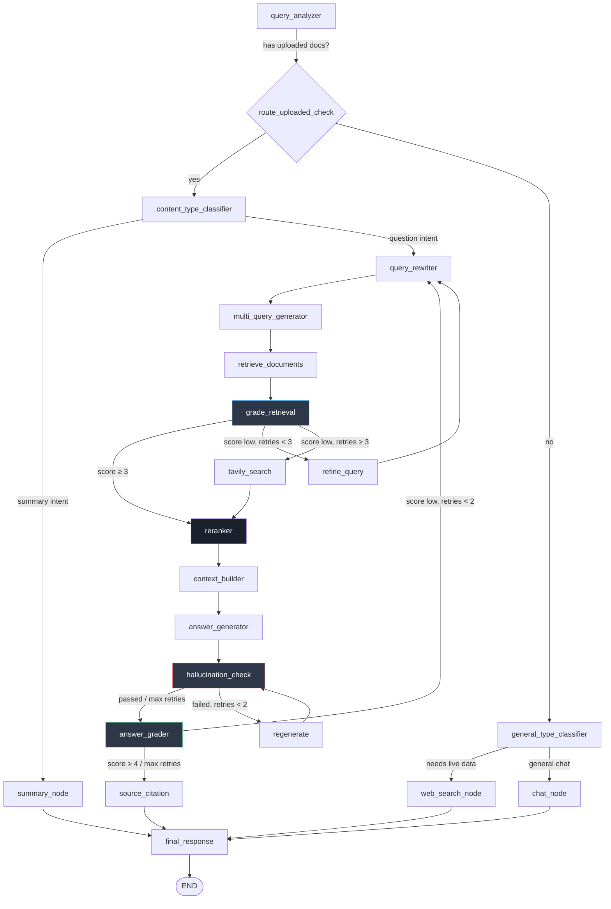

<div align="center">

# 🧠 PNX AI

### Self-Correcting Agentic RAG Chatbot

*A production-grade Retrieval-Augmented Generation system that grades its own retrieval, catches its own hallucinations, and rewrites its own answers — without a human in the loop.*

<<<<<<< HEAD


[Overview](#-overview) • [Architecture](#️-architecture) • [Self-Correction](#-self-correction) • [Evaluation](#-evaluation) • [Tech Stack](#-tech-stack) • [Getting Started](#-getting-started)
=======
[](https://www.python.org/)
[](https://fastapi.tiangolo.com/)
[](https://langchain-ai.github.io/langgraph/)
[](https://www.pinecone.io/)
[](https://nodejs.org/)
[](LICENSE)

[Overview](#-overview) • [Architecture](#-architecture) • [Self-Correction](#-self-correction-mechanisms) • [Evaluation](#-evaluation-results) • [Tech Stack](#-tech-stack) • [Getting Started](#-getting-started)
>>>>>>> 4010f25870d7d8e4f3650cd2cd9c0a236fc8518c

</div>

---

## 📖 Overview

<<<<<<< HEAD
PNX AI is an agentic RAG chatbot built to solve a problem most naive RAG systems ignore: *what happens when retrieval pulls the wrong chunk, or the model hallucinates anyway?*

Instead of a fixed retrieve → generate pipeline, PNX AI is built as a cyclic LangGraph workflow where every stage is graded, and failures trigger automatic, bounded self-correction loops:

- 🔍 **Retrieval is graded** — if retrieved documents don't score well enough, the query is rewritten and retried (up to 3x) before falling back to live web search
- 🛡️ **Every answer is checked for hallucination** against its source context before it's shown to the user — failing answers are regenerated (up to 2x)
- 🎯 **Results are reranked** using the Jina API for semantic relevance, not just raw vector similarity
- 📄 **Full documents can be summarized** via map-reduce, separate from the Q&A path
- 🌐 **Falls back to web search** when the document simply doesn't have the answer

### Key Features

| Feature | What It Does |
|---|---|
| Query Classification | Routes each question to RAG, chat, web search, or summary mode |
| Query Rewriting | Rewrites unclear questions for better retrieval |
| Multi-Query Retrieval | Searches with 3+ phrasing variations per question |
| Retrieval Grading | Scores whether retrieved docs actually answer the question |
| Semantic Reranking | Jina API reranks by relevance, not just similarity |
| Hallucination Detection | Flags answers not supported by retrieved context |
| Adaptive Re-generation | Regenerates up to 2x when hallucination is detected |
| Web Fallback | Tavily search when document retrieval fails |
| Citation Tracking | Every answer returns its sources |
| Streaming API | Real-time SSE updates as the pipeline runs |
=======
**PNX AI** is an agentic RAG chatbot built to solve a problem most naive RAG systems ignore: *what happens when retrieval pulls the wrong chunk, or the model hallucinates anyway?*

Instead of a fixed retrieve → generate pipeline, PNX AI is built as a **cyclic LangGraph workflow** where every stage is graded, and failures trigger automatic, bounded self-correction loops:

- 🔍 **Retrieval is graded** — if retrieved documents don't score well enough, the query is rewritten and retried (up to 3x) before falling back to live web search
- 🛡️ **Every answer is checked for hallucination** against its source context before it's shown to the user — failing answers are regenerated (up to 2x)
- ✅ **Every answer is graded for quality** — low-scoring answers trigger a full query rewrite and retry (up to 2x)
- 🎯 **Query-aware routing** — the graph dynamically routes between RAG, general chat, live web search, and document summarization based on what the user actually needs

This isn't a LangChain quickstart wrapped in a chat UI — it's a full evaluator-optimizer architecture, benchmarked with real metrics (below), and built as a two-person capstone project: an agentic AI backend paired with a full-stack web frontend.
>>>>>>> 4010f25870d7d8e4f3650cd2cd9c0a236fc8518c

---

## 🏗️ Architecture
<<<<<<< HEAD
=======

PNX AI combines three established RAG patterns into one system:

| Pattern | What PNX AI Does |
|---|---|
| **Self-RAG** | Retrieval is graded before use; irrelevant context never reaches the generator |
| **Corrective RAG** | Failed retrieval triggers query refinement or falls back to live web search (Tavily) |
| **Agentic RAG** | The graph makes autonomous routing decisions — RAG vs. chat vs. web vs. summary — per query, with tool-bound reasoning |

### The Graph



### Why this matters

Every arrow that loops back is a **self-correction cycle** with a hard retry cap — the system attempts to fix itself, but never spins forever. This is the difference between "a RAG demo" and a system designed to degrade gracefully under imperfect retrieval or imperfect generation.

---

## 🔁 Self-Correction Mechanisms
>>>>>>> 4010f25870d7d8e4f3650cd2cd9c0a236fc8518c

| Stage | Trigger | Recovery Action | Max Retries |
|---|---|---|---|
| **Retrieval Grading** | Retrieved docs score < 3/5 relevance | Rewrite query and re-retrieve | 3 |
| **Retrieval Fallback** | Retrieval still failing after 3 retries | Fall back to live Tavily web search | — |
| **Hallucination Check** | Generated answer isn't grounded in context | Regenerate the answer from the same context | 2 |
| **Answer Grading** | Answer scores < 4/5 quality | Full query rewrite and re-run from retrieval | 2 |

<<<<<<< HEAD
```
User Question
     │
Query Analyzer  ← routes to RAG | Chat | Web | Summary
     │
     ├── Chat Node
     ├── RAG Route (complex, multi-step)
     ├── Web Route (simple lookup)
     └── Summary Route (map-reduce)
     │
Final Response (with sources)
```
=======
This design means a single bad retrieval or a single hallucinated draft is **never** shown to the user — it's caught, corrected, and re-verified before the response is finalized in `source_citation` → `final_response`.
>>>>>>> 4010f25870d7d8e4f3650cd2cd9c0a236fc8518c

---

<<<<<<< HEAD
```
1. Query Rewriter
2. Multi-Query Generator (3 variations)
3. Retrieve (Pinecone, filtered by thread)
4. Grade Retrieval (0–5)
     ├─ ≥3 → continue
     ├─ retry <3 → refine & retry
     └─ max retries → web search fallback
5. Rerank (Jina, top 5)
6. Context Builder
7. Answer Generator
8. Hallucination Check
     ├─ pass → continue
     ├─ fail, retry <2 → regenerate (stricter prompt)
     └─ max retries → accept answer anyway
9. Answer Grader (0–5)
     ├─ ≥4 → return to user
     └─ <4, retry <2 → retry entire pipeline
10. Citation Formatting → Final Response
```
=======
## 📊 Evaluation Results

PNX AI was evaluated end-to-end using **DeepEval**, with a local Ollama-hosted Mistral 7B as the LLM judge, across 15 domain-specific Q&A pairs built from an ingested reference document.

| Metric | Score | Pass Rate | What It Measures |
|---|---|---|---|
| **Contextual Precision** | 🟢 1.00 | 100% (15/15) | Are retrieved chunks actually relevant? |
| **Contextual Recall** | 🟢 1.00 | 100% (15/15) | Did retrieval find everything needed? |
| **Hallucination** | 🟢 0.00 *(lower = better)* | 100% (15/15) | Did the answer fabricate anything? |
| **Answer Relevancy** | 🟢 0.95 | 100% (15/15) | Does the answer address the question? |
| **Faithfulness** | 🟡 0.89 | 80% (12/15) | Is the answer grounded in retrieved context? |
| **Contextual Relevancy** | 🟡 0.82 | 80% (12/15) | Is the retrieved context relevant overall? |

> **On the two sub-100% metrics:** manual inspection of every sub-threshold case showed the pipeline's actual output was *identical* to the correct answer. The lower scores trace to known limitations of using a lightweight local judge model (Mistral 7B) rather than a genuine faithfulness or relevancy gap in the pipeline — a documented, defensible finding rather than a pipeline flaw.

**Headline result:** perfect retrieval accuracy, zero hallucinations, and near-perfect answer relevancy — validated with a real evaluation framework, not just eyeballed outputs.

---

## 🛠️ Tech Stack

<table>
<tr>
<td valign="top" width="50%">

**AI Backend**
- 🐍 **FastAPI** — API layer
- 🕸️ **LangGraph** — agentic workflow orchestration
- 🧠 **Mistral AI** — LLM (generation, grading, classification)
- 🌲 **Pinecone** — vector store, `thread_id`-scoped retrieval
- 🔗 **Supabase** — persistence layer
- 🎯 **Jina AI** — cross-encoder reranking
- 🌐 **Tavily** — live web search fallback
- ✅ **DeepEval** — RAG evaluation framework

</td>
<td valign="top" width="50%">

**Web Frontend**
- 🟢 **Node.js / Express** — API server
- 🍃 **MongoDB** — application data
- ⚛️ *(chat interface, thread management)*

**Dev & Eval Tooling**
- 🦙 **Ollama** — local LLM judge for evaluation
- 🔍 **LangSmith** — tracing & observability

</td>
</tr>
</table>
>>>>>>> 4010f25870d7d8e4f3650cd2cd9c0a236fc8518c

---

## 🛡️ Self-Correction

<<<<<<< HEAD
Three independent validation layers keep bad answers from reaching the user:

| Layer | Checks | On Failure |
|---|---|---|
| **Retrieval Grading** | Are retrieved docs relevant? (0–5) | Refine query & retry (max 3x), then web fallback |
| **Hallucination Detection** | Is the answer grounded in context? | Regenerate with stricter prompt (max 2x) |
| **Answer Grading** | Is the answer complete & accurate? (0–5) | Retry entire pipeline (max 2x) |

**Example flow:**

| Stage | Output | Result |
|---|---|---|
| Q: "Who founded OpenAI?" | — | — |
| Retrieval | Docs found (score 3.2) | ✅ Proceed |
| Generation | "Sam Altman and John Smith founded OpenAI" | — |
| Hallucination Check | Not supported by docs | ❌ Fail |
| Regenerate | "I don't have that information in the provided documents" | ✅ Pass |
| Answer Grade | 4.1 | ✅ Returned to user |

---

## 📊 Evaluation

The RAG pipeline was evaluated end-to-end on a 15-question golden dataset built from a technical PDF, using [DeepEval](https://github.com/confident-ai/deepeval) with Groq (`openai/gpt-oss-120b`) as the judge model.

| Metric | Avg Score | Pass Rate |
|---|---|---|
| Faithfulness | 0.92 | 86.7% |
| Answer Relevancy | 0.91 | 93.3% |
| Hallucination *(lower = better)* | 0.07 | 93.3% |
| Contextual Precision | 0.75 | 73.3% |
| Contextual Recall | 0.77 | 73.3% |

**Reading the results:** generation quality (Faithfulness, Answer Relevancy, Hallucination) is consistently strong at 85–93%. Retrieval (Precision, Recall) is the weaker layer at 73–77%, mainly on multi-hop questions requiring facts from two sections at once, plus a few empty-retrieval misses — a well-known, common RAG failure mode rather than a bug specific to this pipeline.

---

## 🔌 Tech Stack

| Layer | Tools |
|---|---|
| LLM & Embeddings | Mistral AI (small + large), LangChain |
| Orchestration | LangGraph |
| Vector DB | Pinecone |
| File Storage | Supabase |
| Web Search | Tavily |
| Reranking | Jina |
| Backend | FastAPI, Pydantic |
| Observability | LangSmith (optional) |

---

## 🚀 Getting Started

### Prerequisites
- Python 3.10+
- API keys: Mistral AI, Pinecone, Tavily, Jina, Supabase

### 1. Clone & Install

```bash
git clone https://github.com/parth5980/Agentic-Self-Healing-RAG-Chatbot.git
cd Agentic-Self-Healing-RAG-Chatbot

python -m venv venv
source venv/bin/activate  # Windows: venv\Scripts\activate

pip install -r backend-ai/requirements.txt
```

### 2. Configure `.env`

```env
MISTRAL_API_KEY=your-mistral-key
LANGSMITH_API_KEY=your-langsmith-key
PINECONE_API_KEY=your-pinecone-key
TAVILY_API_KEY=your-tavily-key
JINA_API_KEY=your-jina-key
SUPABASE_URL=your-supabase-url
SUPABASE_KEY=your-supabase-key
SUPABASE_BUCKET=pnx-ai-documents
```

### 3. Run
=======
```
Agentic-Self-Healing-RAG-Chatbot/
├── backend-ai/                    # Python / FastAPI / LangGraph backend
│   ├── app/
│   │   ├── graph.py                # LangGraph workflow definition & routing
│   │   ├── nodes.py                # All node implementations
│   │   ├── state.py                # AgentState schema
│   │   └── ingest.py               # Document ingestion (PDF/DOCX/TXT)
│   ├── main.py                     # FastAPI entrypoint
│   ├── eval_deepeval.py            # Core 4-metric evaluation
│   ├── eval_deepeval_extra.py      # Hallucination + Contextual Relevancy
│   └── clear_db.py
│
└── backend-web/                    # Node.js / Express / MongoDB frontend
    └── ...
```

---

## 🚀 Getting Started

### Prerequisites
- Python 3.11+
- Node.js 18+
- Pinecone, Supabase, Mistral AI, Jina, and Tavily API keys
- (Optional, for local eval) [Ollama](https://ollama.com) with `mistral` pulled

### Backend Setup
>>>>>>> 4010f25870d7d8e4f3650cd2cd9c0a236fc8518c

```bash
cd backend-ai
pip install -r requirements.txt
cp .env.example .env    # add your API keys
python main.py
```

<<<<<<< HEAD
Server runs at `http://localhost:8000`

### 4. Try It

```bash
curl http://localhost:8000/health

THREAD_ID=$(curl -s -X POST http://localhost:8000/new-chat | jq -r '.thread_id')

curl -X POST http://localhost:8000/chat \
  -H "Content-Type: application/json" \
  -d '{"message": "What is RAG?", "thread_id": "'$THREAD_ID'", "chat_history": []}'
=======
### Frontend Setup

```bash
cd backend-web
npm install
npm start
>>>>>>> 4010f25870d7d8e4f3650cd2cd9c0a236fc8518c
```

### Running the Evaluation Suite

<<<<<<< HEAD
## 📁 Project Structure

```
backend-ai/
├── main.py            # FastAPI app with 4 endpoints
├── app/
│   ├── config.py      # LLM, embeddings & API keys
│   ├── state.py       # TypedDict for pipeline state
│   ├── graph.py       # LangGraph workflow (core orchestration)
│   ├── nodes.py       # 18 individual processing nodes
│   ├── ingest.py      # Document upload & indexing
│   └── __init__.py
├── test folder/        # Testing notebooks
└── .env.example

backend-express/        # Frontend/orchestration layer (MERN stack)
```

| Module | Purpose |
|---|---|
| `nodes.py` | 18 pipeline nodes: query analyzer, rewriter, retriever, hallucination checker, etc. |
| `graph.py` | LangGraph state machine, 4 conditional edge functions |
| `main.py` | FastAPI server, REST endpoints, SSE streaming |
| `config.py` | LLM clients, embeddings, Pinecone, Supabase, API keys |
| `state.py` | `AgentState` TypedDict, 16 fields tracking pipeline progress |
| `ingest.py` | PDF/text/URL/YouTube loading, chunking, embedding, indexing |

---

## 📡 API Endpoints

### `POST /new-chat`
Creates a new conversation thread.
```json
{ "thread_id": "550e8400-e29b-41d4-a716-446655440000" }
```

### `POST /chat`
Sends a question, streams the pipeline response via SSE.
```json
{
  "message": "What is RAG?",
  "thread_id": "550e8400-e29b-41d4-a716-446655440000",
  "chat_history": []
}
```
```
data: {"type": "status", "message": "🔍 Analyzing query..."}
data: {"type": "status", "message": "📚 Retrieving documents..."}
data: {"type": "answer", "content": "RAG is...\n\n**Sources:**\n[1] document.pdf"}
data: {"type": "done"}
```

### `POST /ingest`
Uploads and indexes a document.
```json
{ "success": true, "message": "Successfully ingested 42 chunks from pdf", "chunks": 42 }
```

### `GET /health`
```json
{ "status": "ok" }
```

---

## 🐛 Known Limitations

- **No persistence** — chat history is stateless, passed per request
- **No authentication** — anyone can call the API
- **Limited testing** — testing notebooks only, no pytest suite
- **Retry logic** — can theoretically loop if the answer score never clears the threshold
- **No rate limiting** built in
- **Single-tenant** — all threads share the same Pinecone index

---

## 🛠️ Troubleshooting

| Issue | Fix |
|---|---|
| `Cannot import module app.graph` | Run from the `backend-ai` directory |
| `API key not found` | Check `.env` has all required keys |
| `Pinecone connection failed` | Verify API key + index name (`rag-chatbot`) |
| `No documents retrieved` | Upload via `/ingest` first; check `thread_id` matches |
| `Supabase upload failed` | Verify bucket name and public read permissions |
| Rate limited | Tavily (10/day free tier), check Jina/Pinecone/Mistral quotas |
=======
```bash
cd backend-ai
python eval_deepeval.py         # Core metrics: Faithfulness, Answer Relevancy, Precision, Recall
python eval_deepeval_extra.py   # Extra metrics: Hallucination, Contextual Relevancy
```

Results are saved to `deepeval_results.csv`, `deepeval_batch_summary.csv`, and `deepeval_failures.csv`.

---

## 🗺️ Roadmap

- [ ] Expand evaluation dataset beyond single-document Q&A to multi-document synthesis questions
- [ ] Swap local judge model for a stronger evaluator to reduce false-negative Faithfulness scores
- [ ] Add LangSmith-based online evaluation for production traffic monitoring

---

## 👥 Team

Built as a B.Tech capstone project.

- **AI Backend** (Python, FastAPI, LangGraph) — Parth
- **Web Frontend** (Node.js, Express, MongoDB) — ashish

---

## 📄 License

This project is licensed under the MIT License — see [LICENSE](LICENSE) for details.

---

## Contributing

Contributions, issues, and feature requests are welcome. Please open an issue or a pull request and include a short description of your change.

---

## Contact

For questions about the project, reach out to Parth via your GitHub profile.
>>>>>>> 4010f25870d7d8e4f3650cd2cd9c0a236fc8518c

<div align="center">

<<<<<<< HEAD
## 📈 Performance Tips

1. **Reduce chunk size** in `ingest.py` (`chunk_size=500`) if retrieval is slow — trade-off: more chunks, more compute
2. **Skip reranking** by commenting out the reranker node in `graph.py` if cost is a concern
3. **Use Mistral Small everywhere** for faster, lower-quality responses
4. **Lower max retries** in `graph.py`'s routing functions to fail faster
5. **Batch ingest** for many documents via Pinecone's batch API

---

## 🚀 What's Next

- [ ] Add pytest suite
- [ ] Persist chat history to a database
- [ ] Add authentication & multi-tenant isolation
- [ ] Build a React frontend
- [ ] Deploy to production (Fly.io, Railway, or AWS)
- [ ] Add a live metrics dashboard
- [ ] Tighten retrieval (query decomposition for multi-hop questions, reranking thresholds)

---

## 📖 Resources

**RAG:** [Pinecone's guide](https://www.pinecone.io/learn/retrieval-augmented-generation/) · [LangChain RAG tutorial](https://python.langchain.com/docs/use_cases/question_answering/)
**LangGraph:** [Docs](https://langchain-ai.github.io/langgraph/) · [LangSmith tracing](https://smith.langchain.com/)
**FastAPI:** [Official guide](https://fastapi.tiangolo.com/) · [SSE streaming](https://fastapi.tiangolo.com/advanced/server-sent-events/)

---

<div align="center">

**Made while learning AI/ML** 🎓

=======
*If you found this project interesting, consider giving it a ⭐*

>>>>>>> 4010f25870d7d8e4f3650cd2cd9c0a236fc8518c
</div>
